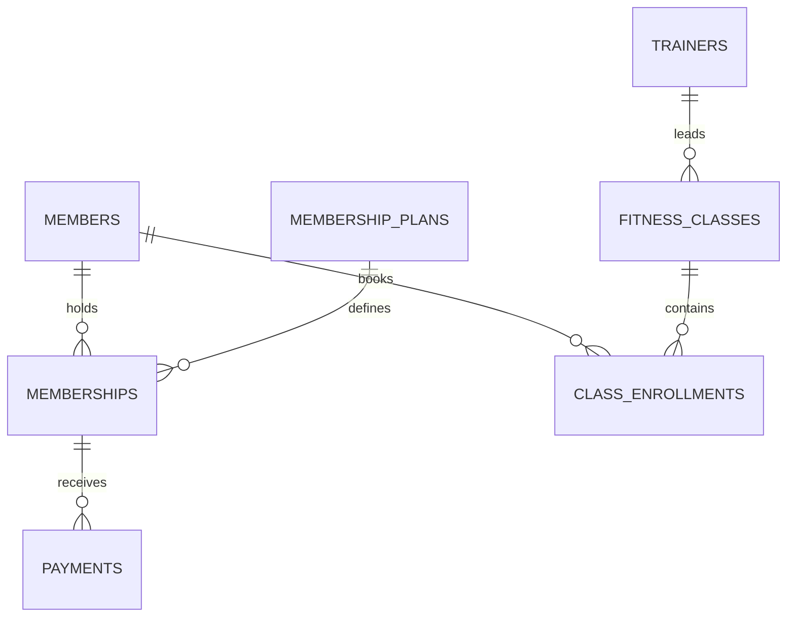

# Gym Management Database

A normalized SQLite database and Python reporting project for managing gym
memberships, payments, trainers, classes, bookings, and attendance.

The project models day-to-day gym operations and answers practical questions
about active members, revenue collection, membership mix, class utilization,
trainer workload, and members who may need follow-up.

## What this project demonstrates

- Relational database design and third normal form
- Primary keys, foreign keys, unique constraints, checks, and indexes
- Many-to-many relationships through a class-enrollment table
- SQL joins, common table expressions, aggregation, date logic, and subqueries
- Currency stored as integer cents to avoid floating-point errors
- Python database initialization, analysis orchestration, and reporting
- Automated tests for business rules and data integrity

## Entity relationship diagram



## Business questions answered

1. How many active and frozen members does the gym have?
2. How much successful payment revenue was collected this month?
3. Which membership plans are most popular?
4. Which classes have the strongest attendance and capacity utilization?
5. How many sessions is each trainer scheduled to lead?
6. Which current members have payment issues or no recent attendance?

## Project structure

```text
sql/schema.sql             Normalized tables, rules, and indexes
sql/seed.sql               Fictional portfolio data
sql/business_queries.sql   Named operational and management queries
src/gym_database/          Python database, analytics, CLI, and reporting code
tests/                     Automated integrity and analytics tests
sample_report.md           Reproducible example report
```

## Quick start

Requires Python 3.10 or newer. No third-party packages are required.

```bash
PYTHONPATH=src python -m gym_database --output gym_report.md
```

The default reporting window is August 2026 so the sample output stays
reproducible. A different window can be supplied:

```bash
PYTHONPATH=src python -m gym_database \
  --report-start 2026-08-01 \
  --report-end 2026-08-31 \
  --as-of 2026-08-31 \
  --output gym_report.md
```

Run the tests:

```bash
PYTHONPATH=src python -m unittest discover -s tests -v
```

## Design decisions

- A member can have several memberships over time without duplicating personal
  details.
- Plan pricing is stored with the plan that was sold through
  `agreed_price_cents`, preserving historical pricing.
- Class bookings form a many-to-many relationship between members and classes.
- Payment and attendance statuses are constrained to known values.
- All names and records are fictional and contain no customer information.

## Possible next steps

- Add waitlists and automatic capacity enforcement
- Add membership check-in events and retention cohorts
- Create a web dashboard for staff
- Add role-based access for reception, trainers, and managers

